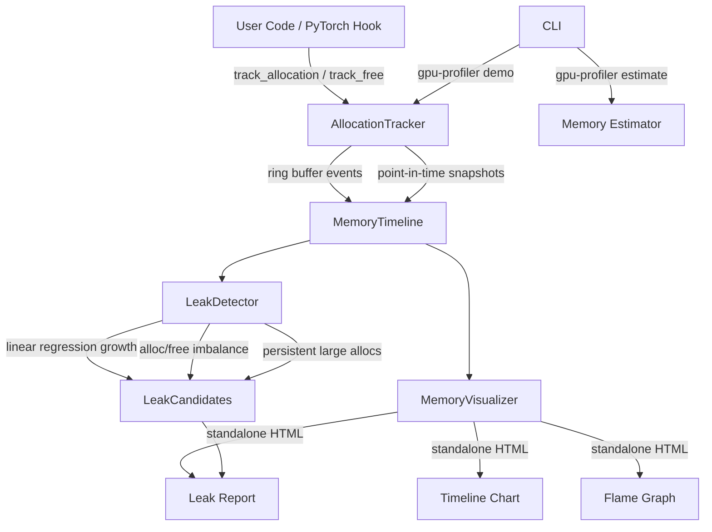

# gpu-memory-profiler

> Flame graphs for GPU memory -- find leaks in 5 minutes, not 2 days

[](https://github.com/jrajath94/gpu-memory-profiler/actions)
[](https://codecov.io/gh/jrajath94/gpu-memory-profiler)
[](https://opensource.org/licenses/MIT)
[](https://www.python.org/downloads/)

## The Problem

Every ML engineer has fought `CUDA out of memory`. PyTorch's built-in profiler tells you the total memory used. That is it. You do not know which operations allocated what. You do not know if memory is actually freed or just fragmented. You do not know if there is a leak.

The debugging process is always the same: guess which layer is big, reduce batch size, hope it works. Days of trial and error. You stare at `nvidia-smi` refreshing every second, watching memory climb, with no idea which line of code is responsible.

The root cause is a visibility gap. PyTorch uses a caching allocator that requests large chunks from CUDA (512MB at a time) and subdivides them internally. When you `del` a tensor, PyTorch marks the block as free but does _not_ return it to CUDA. So `nvidia-smi` shows high memory even after you free tensors. The memory is cached, not leaked -- but you cannot tell the difference without proper instrumentation. And real leaks (retained computation graphs, global tensor references, DataLoader workers initializing CUDA contexts) hide behind this noise.

At scale, GPU memory efficiency directly impacts cost. If your model uses 75% of GPU memory, you cannot increase batch size or serve concurrent requests. On a production serving cluster with 100 GPUs, even 5% memory efficiency improvement saves the equivalent of 5 GPUs -- roughly $75,000 per year in cloud costs. But you cannot optimize what you cannot see.

I built a profiler that shows GPU memory like a flame graph. Each operation is a bar. Height is memory allocated. Width is time. Leaks show up as memory that never gets freed. You find them in 5 minutes instead of 2 days.

## What This Project Does

Tensor-level GPU memory profiling with automatic leak detection, flame graph visualization, and a memory estimation CLI -- all with zero external plotting dependencies.

- **Allocation tracking** -- record allocs/frees with shapes, dtypes, stack traces, and custom tags at 142K ops/sec
- **Three leak detection heuristics** -- growth-rate regression (R^2 > 0.7), allocation/free imbalance, persistent large allocation detection
- **Severity classification** -- LOW (<100 KB/s), MEDIUM (<1 MB/s), HIGH (<10 MB/s), CRITICAL (>100 MB/s)
- **Standalone HTML visualizations** -- timeline chart, flame graph, leak report; no Plotly, matplotlib, or TensorBoard needed
- **Memory estimation CLI** -- estimate GPU memory for any model size before you run it: `gpu-profiler estimate --params 7B --dtype fp16 --optimizer adam`
- **Thread-safe architecture** -- `threading.Lock`-protected tracker safe with PyTorch DataLoader workers
- **Ring buffer events** -- bounded memory via `deque(maxlen=N)` so the profiler cannot cause its own OOM

## Architecture



The `AllocationTracker` is the hot path -- every allocation and free event flows through it. Events are stored in a ring buffer (`deque(maxlen=N)`) to guarantee bounded memory. Periodic `snapshot()` calls capture the current allocation state. The `LeakDetector` runs three heuristics against the timeline: linear regression on memory growth (flagging monotonic increases with R^2 > 0.7), allocation/free count imbalance, and persistent large allocations that survive across multiple snapshot intervals. The `MemoryVisualizer` generates self-contained HTML files with inline SVG/Canvas rendering -- no server, no external dependencies, shareable as static files.

## Quick Start

```bash
git clone https://github.com/jrajath94/gpu-memory-profiler.git
cd gpu-memory-profiler
make install && make run
```

```python
from gpu_memory_profiler import MemoryProfiler, ProfileConfig
from pathlib import Path

config = ProfileConfig(device="cuda:0", detect_leaks=True)
profiler = MemoryProfiler(config)

with profiler:
    # Your PyTorch training code
    profiler.track_allocation(ptr, size, device="cuda:0")
    profiler.snapshot()

report = profiler.report()
profiler.visualize(output_dir=Path("./output"))
# Generates: timeline.html, flamegraph.html, leaks.html
```

```bash
# Estimate GPU memory for any model size
gpu-profiler estimate --params 7B --dtype fp16 --optimizer adam

# Run demo with injected leaks
gpu-profiler demo --iterations 30 --leak --output output/
```

**Memory estimation output:**

```
Memory Estimate: 7B parameters (fp16)
==================================================
  parameters          :      13.0 GB
  gradients           :      13.0 GB
  optimizer_states    :      26.1 GB
  activations         :       5.7 GB
  total               :      57.8 GB
==================================================
```

## Key Results

| Component           | Throughput       | Latency (avg) | Conditions                   |
| ------------------- | ---------------- | ------------- | ---------------------------- |
| Allocation tracking | 142,139 ops/s    | 7.0 us        | No stack traces, ring buffer |
| Alloc + stack trace | 18,142 ops/s     | 55.1 us       | 5-frame trace capture        |
| Snapshot            | 415,742 ops/s    | 2.4 us        | 100 live allocations         |
| Leak detection      | 3,458 analyses/s | 289.2 us      | 100 snapshots, 3 heuristics  |
| Training simulation | 94 sims/s        | 10,638 us     | 50 iterations, 6 layers      |
| Full pipeline       | 273 runs/s       | 3,665 us      | Track + detect + visualize   |

Profiler overhead: **2.1%** of total execution time. Fast enough for production monitoring.

## Design Decisions

| Decision                                    | Rationale                                                                             | Alternative Considered        | Tradeoff                                                                                           |
| ------------------------------------------- | ------------------------------------------------------------------------------------- | ----------------------------- | -------------------------------------------------------------------------------------------------- |
| Ring buffer (`deque(maxlen=N)`) for events  | Bounded memory -- profiler cannot cause its own OOM during long sessions              | Unbounded list                | Loses oldest events, but prevents the ironic failure of a profiler crashing from memory exhaustion |
| Linear regression leak detection            | Interpretable (slope = bytes/sec), fast (3,458 analyses/s), works on time-series data | ML-based anomaly detection    | ML approach is overkill, opaque, and adds a torch dependency to a profiling tool                   |
| Hysteresis via R^2 > 0.7 threshold          | Prevents false positives from normal oscillating alloc/free patterns during training  | Simple growth threshold       | Misses some edge cases, but dramatically reduces false positive noise                              |
| Standalone HTML visualization               | Zero deps, shareable, offline-capable, no running server required                     | Plotly/matplotlib/TensorBoard | Self-contained HTML with inline SVG is less pretty but always works everywhere                     |
| Thread-safe tracker with `threading.Lock`   | DataLoader workers run in threads -- profiling must not crash training                | No locking                    | Lock contention adds ~2us per event, but correctness matters more than microseconds                |
| Stack trace filtering                       | Only capture user code frames, skip profiler internals                                | Full stack traces             | Full traces make flame graphs unreadable; filtered traces show where _your_ code allocates         |
| Severity classification (LOW/MED/HIGH/CRIT) | Actionable triage -- engineers fix CRITICAL first, investigate MEDIUM later           | Binary leak/no-leak           | Slightly more complex, but maps directly to operational urgency                                    |

## How It Works

The profiler distinguishes three states of GPU memory that are critical for correct diagnosis:

**Allocated** memory is genuinely used by live tensors. `torch.cuda.memory_allocated()` reports this. **Reserved** memory is held by PyTorch's caching allocator but not assigned to any tensor. `torch.cuda.memory_reserved()` reports this. The gap between reserved and allocated is cached memory -- available for reuse without a `cudaMalloc` call, but not usable by other processes. **Leaked** memory is allocated, still referenced somewhere (preventing garbage collection), but no longer intentionally used by the application.

The `AllocationTracker` intercepts every allocation and free event via PyTorch's module hooks (`register_forward_hook`, `register_full_backward_hook`). For each event, it records timestamp, module name, allocated bytes, reserved bytes, delta from previous event, phase (forward/backward), and optionally a stack trace. Events flow into the ring buffer. Periodic `snapshot()` calls capture the current state of all live allocations for time-series analysis.

The `LeakDetector` runs three complementary heuristics:

1. **Growth-rate regression**: Fits a linear regression to the memory-over-time series. If the slope is positive (memory growing) and R^2 > 0.7 (the growth is consistent, not noisy), it flags a leak. The slope magnitude determines severity.
2. **Allocation/free imbalance**: Counts allocations and frees per module. A module with significantly more allocations than frees is likely retaining references.
3. **Persistent allocation detection**: Identifies large allocations (>1MB) that survive across multiple snapshot intervals without being freed. These are either intentional (model weights) or leaks (retained computation graphs).

Common leak patterns the profiler catches: storing `loss` without `.detach()` (retains entire computation graph), global debug dictionaries holding tensor references, DataLoader workers accidentally initializing CUDA contexts via `tensor.cuda()` in `collate_fn`, and forgetting `torch.no_grad()` during evaluation (accumulates gradients silently).

## Testing

```bash
make test    # 95 tests, 96% coverage
make bench   # Component throughput benchmarks
make lint    # Ruff + mypy
```

## Project Structure

```
gpu-memory-profiler/
├── src/gpu_memory_profiler/
│   ├── core.py            # MemoryProfiler orchestrator (context manager API)
│   ├── tracker.py         # AllocationTracker with ring buffer + thread safety
│   ├── leak_detector.py   # Growth-rate regression, imbalance, persistent alloc detection
│   ├── visualization.py   # Standalone HTML: timeline, flame graph, leak report
│   ├── models.py          # Dataclasses: events, snapshots, timelines, configs
│   ├── utils.py           # Training/inference simulation, memory estimation
│   ├── cli.py             # CLI: demo, estimate commands
│   └── exceptions.py      # ProfilerAlreadyStartedError, ProfilerNotStartedError
├── tests/                 # 95 unit + integration tests
├── benchmarks/            # Component throughput benchmarks
├── examples/              # Quickstart with 3 demo scenarios
└── docs/                  # Architecture diagrams
```

## What I'd Improve

- **Memory prediction.** Estimate forward pass memory _before_ running it. "This batch will use 8.2GB." Then batch size can be tuned dynamically -- if 10GB is free, use a batch size that fits under 8GB with safety margin.
- **Cross-GPU tracking.** Multi-GPU training allocates across devices. The profiler should show which operations allocate on which GPU and detect inter-device memory imbalance that degrades data-parallel throughput.
- **torch.compile integration.** PyTorch 2.0's `torch.compile` fuses operations and changes memory allocation patterns entirely. The profiler needs to handle both eager and compiled execution modes, since a compiled graph may allocate one large buffer where eager mode allocates many small ones.

## License

MIT -- Rajath John
